# ReLIF: Resonator-extended Leaky Integrate-and-Fire Neuron

A resonator has periodic membrane voltage.
If the cycle is at its peak then the neuron can easy reach its threshold.

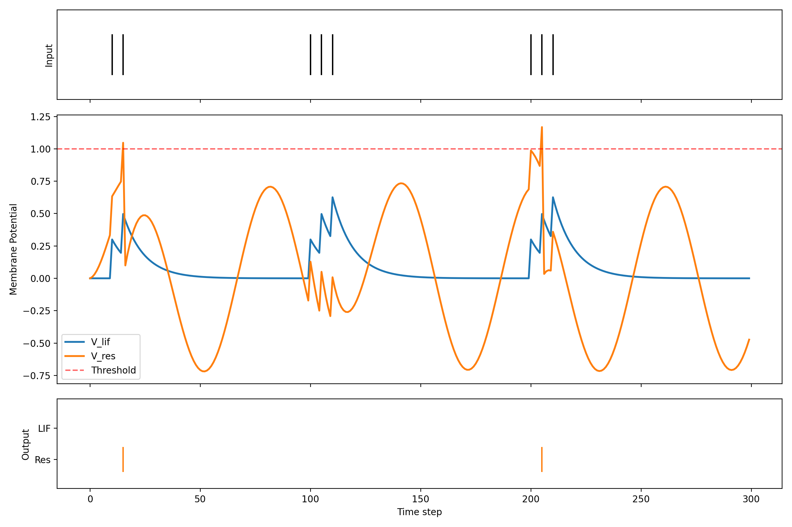

To the membrane voltage v of a leaky-integrate-and-fire neuron is a oscillatory voltage added referred as resonator_activation parameterized by phase and frequency. 
Moreover, it adding this periodic current is gating by an additional parameter called resonating.
In summary: v_total = v + resonating * resonator_activation

The parameters phase, frequency and resonating will be trained end-to-end with backpropagation just like weight matrices and bias.

Note that, the decay of the membrane voltage is applied on v and not on v_total.

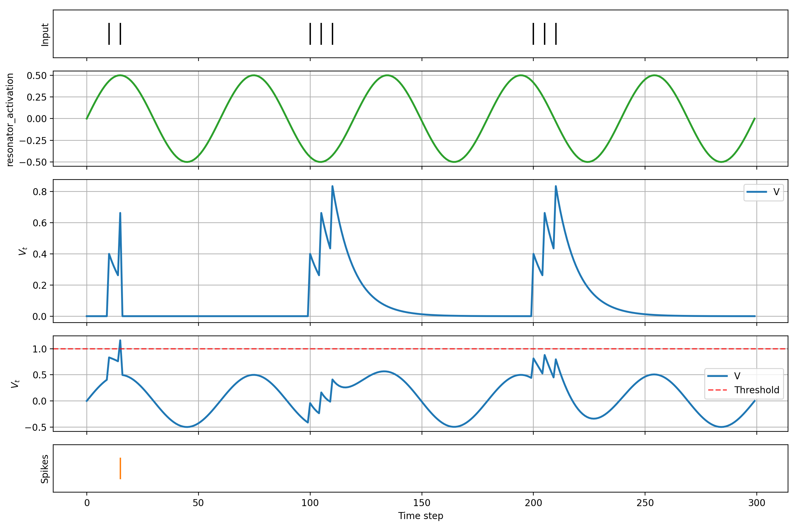

(here resonating was set to 1)

Due to an implementation error, the decay is applied on v_total and every time step resonator_activation was added to v_total :

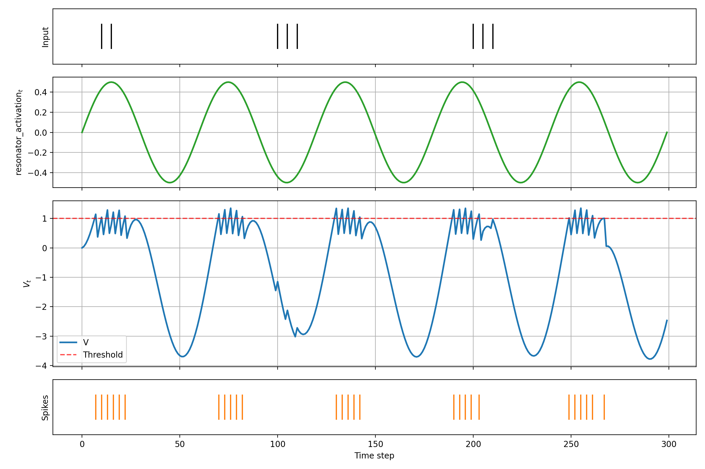

The first implementation is referred as _fixed.

# Training

ReLIF_n means that the max_frequency is n.

## Train accuracy

| Model | NMMNIST | SHD |
| :--- | :---: | :---: |
| LIF | 0.98503 | 0.94493 |
| ReLIF_1 | 0.98935 | 0.96499 |
| ReLIF_2 | **0.99026** | **0.96981** |
| ReLIF_4 | 0.98954 | 0.96663 |
| ReLIF_8 | 0.98994 | 0.96856 |
| ReLIF_1_fixed | 0.98821 |  0.95399 |
| ReLIF_2_fixed | 0.98988 | 0.95824 |
| ReLIF_4_fixed | 0.98788 | 0.96026 |
| ReLIF_8_fixed | 0.98703 | 0.95814 |

## Test accuracy

| Model | NMMNIST | SHD |
| :--- | :---: | :---: |
| LIF | 0.94421 | 0.74509 |
| ReLIF_1 | 0.93820 | 0.84241 |
| ReLIF_2 | 0.93860 | **0.86027** |
| ReLIF_4 | 0.93620 | 0.85223 |
| ReLIF_8 | 0.93980 | 0.85580 |
| ReLIF_1_fixed | 0.94621 | 0.80759  |
| ReLIF_2_fixed | **0.94752** | 0.81786 |
| ReLIF_4_fixed | 0.94601 | 0.81920 |
| ReLIF_8_fixed | 0.94491 | 0.80625 |

# Phase Frequency Plots

## Neuromorphic MNIST (NMMNIST)

### ReLIF_1

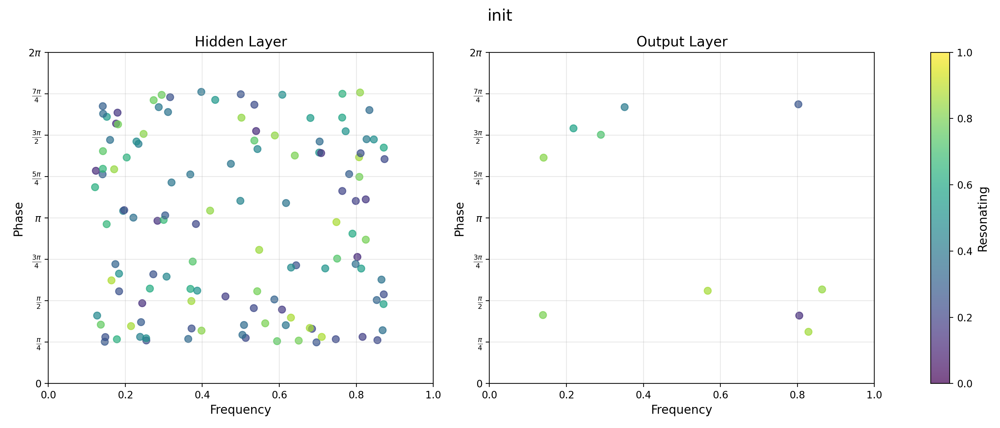

#### fixed

### ReLIF_2

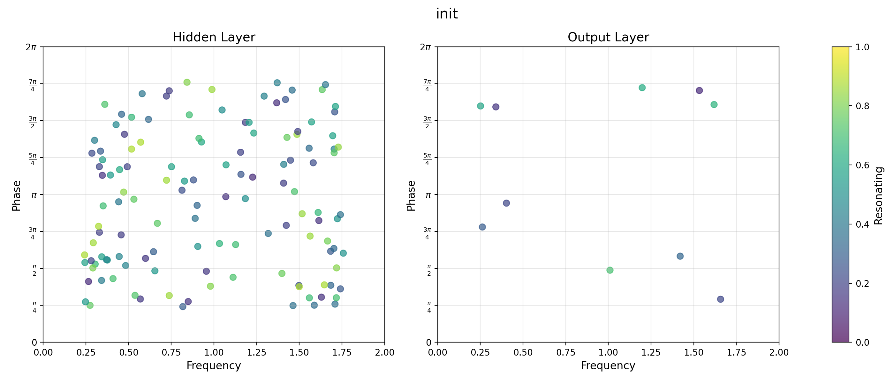

#### fixed

### ReLIF_4

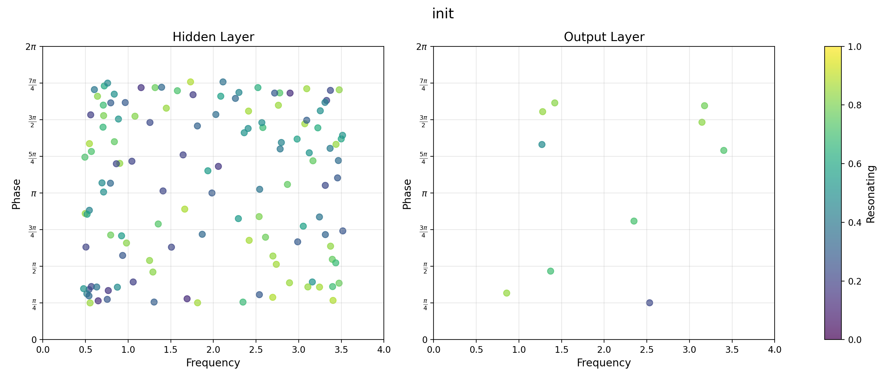

#### fixed

### ReLIF_8

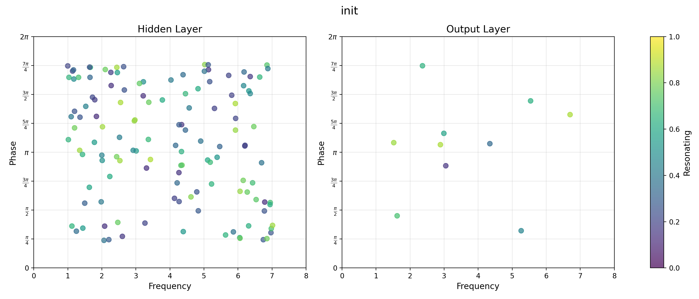

#### fixed

## Spiking Heidelberg Digits (SHD)

### ReLIF_1

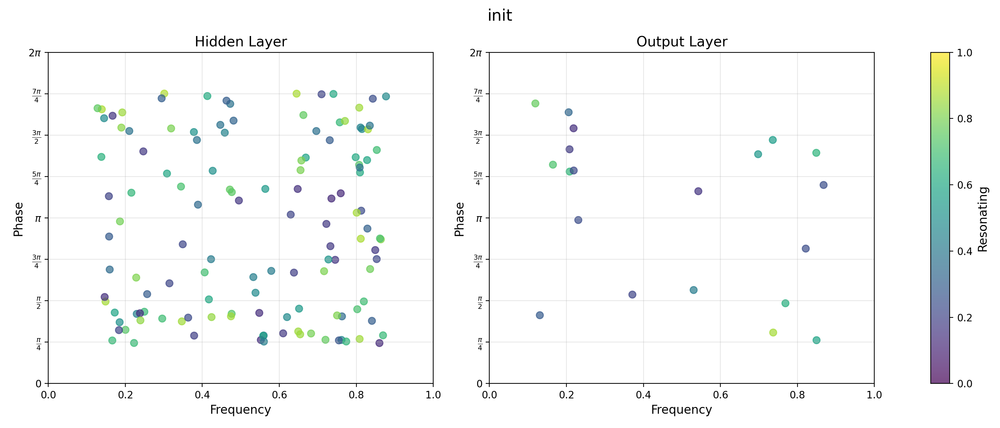

#### fixed

### ReLIF_2

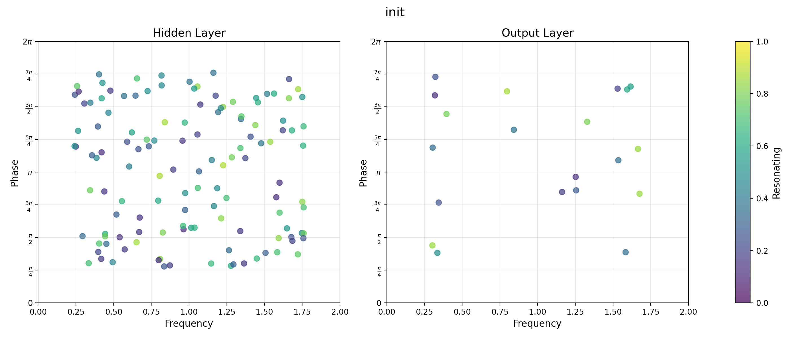

#### fixed

### ReLIF_4

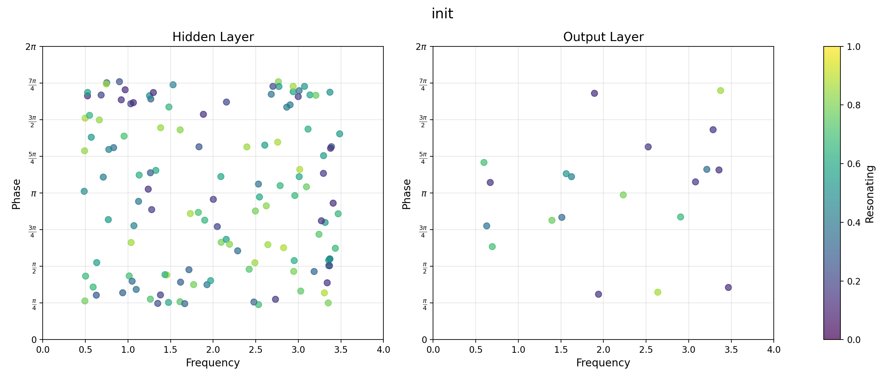

#### fixed

### ReLIF_8

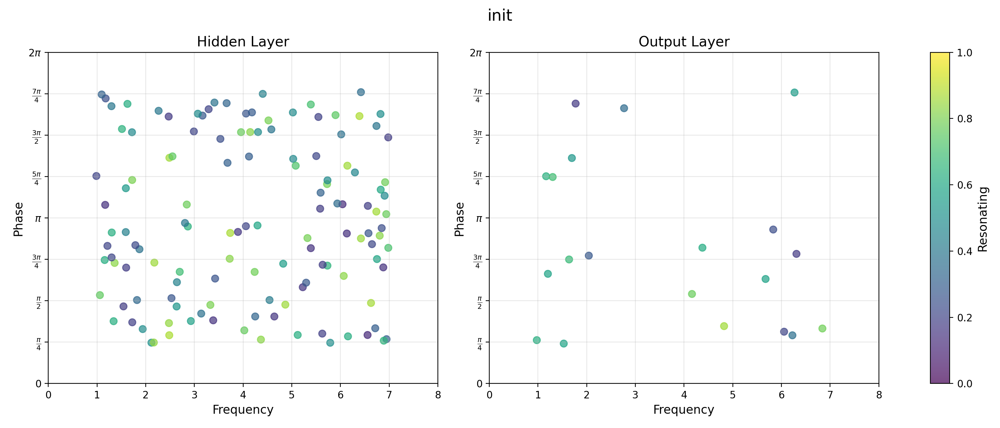

#### fixed

