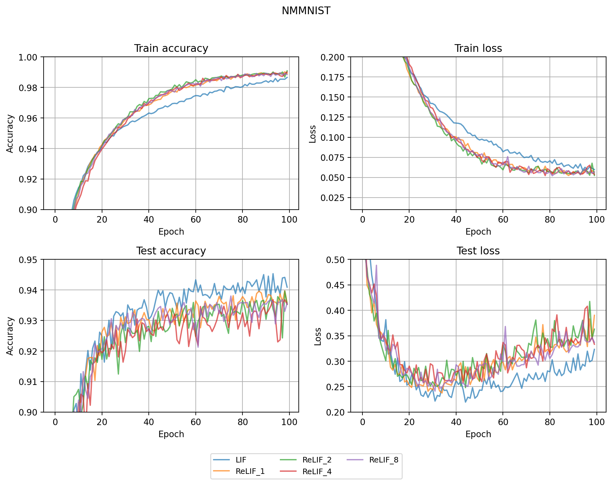
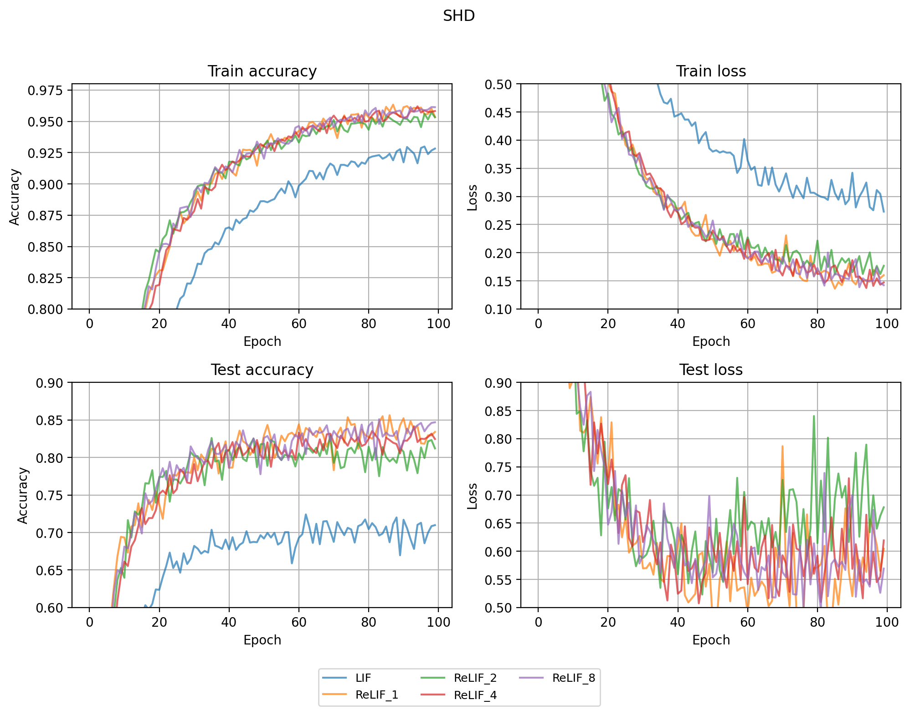
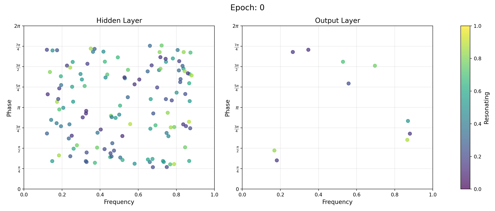

# Training

## Train accuracy

| Model | NMMNIST | SHD |
| :--- | :---: | :---: |
| LIF | 0.98656 | 0.92988 |
| ReLIF_1 | 0.99018 | **0.96335** |
| ReLIF_2 | **0.99085** | 0.95727 |
| ReLIF_4 | 0.99005 | 0.96200 |
| ReLIF_8 | 0.98956 | 0.96142 |

## Test accuracy

| Model | NMMNIST | SHD |
| :--- | :---: | :---: |
| LIF | **0.94531** | 0.72411 |
| ReLIF_1 | 0.93970 | **0.85625** |
| ReLIF_2 | 0.93960 | 0.82946 |
| ReLIF_4 | 0.93680 | 0.84152 |
| ReLIF_8 | 0.93800 | 0.85089 |

# Phase Frequency Plots

## Neuromorphic MNIST

### ReLIF_1

